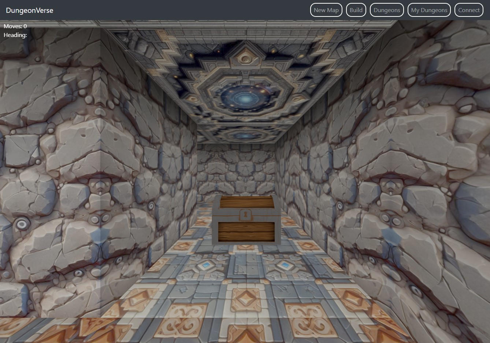
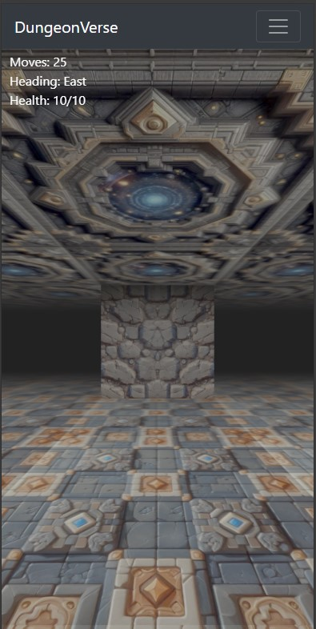
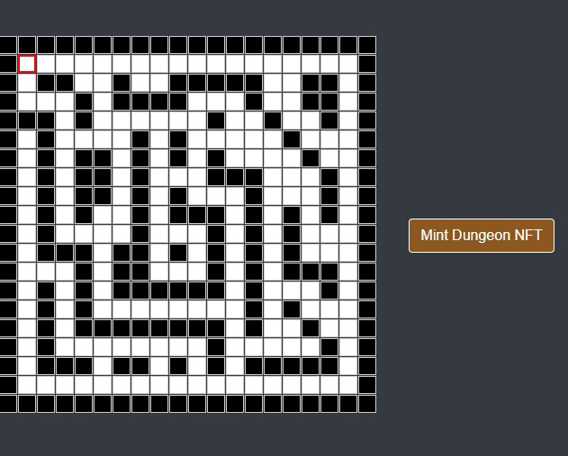
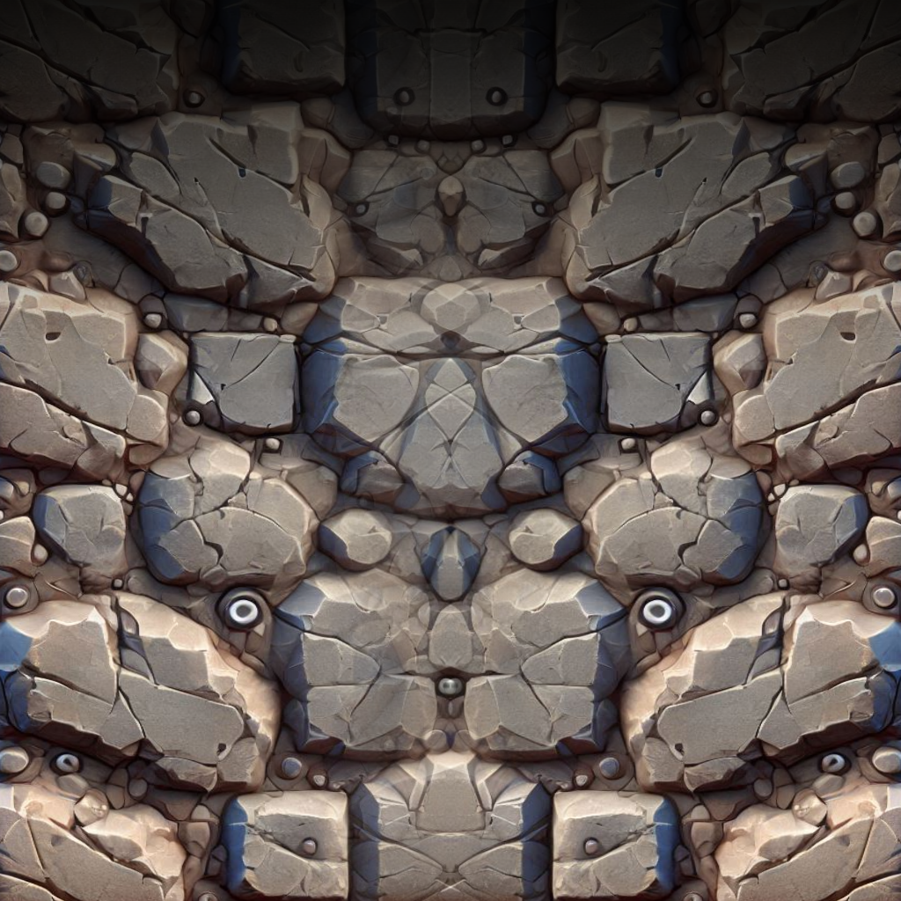
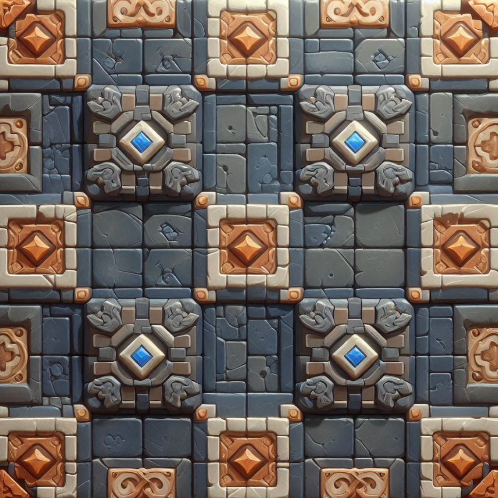
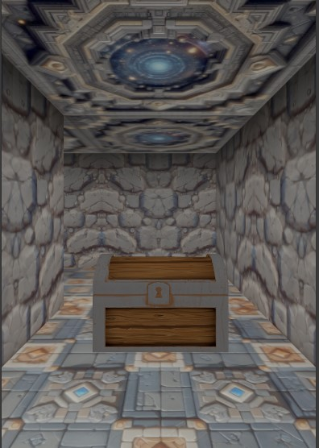
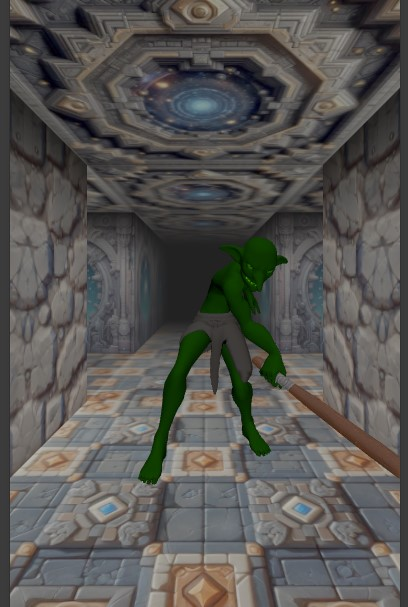
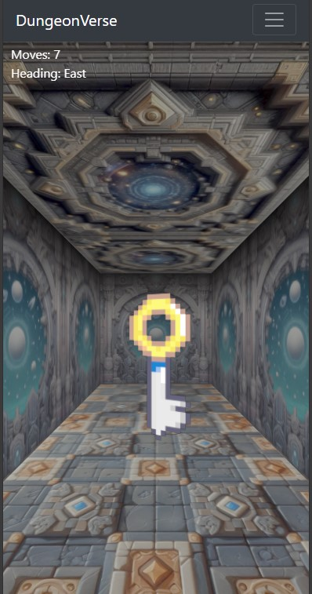
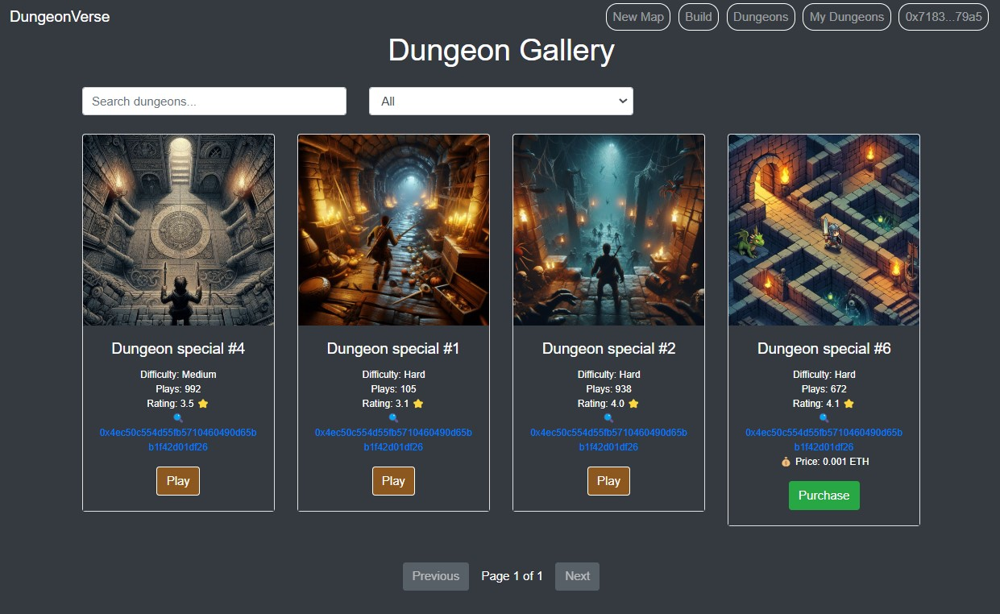
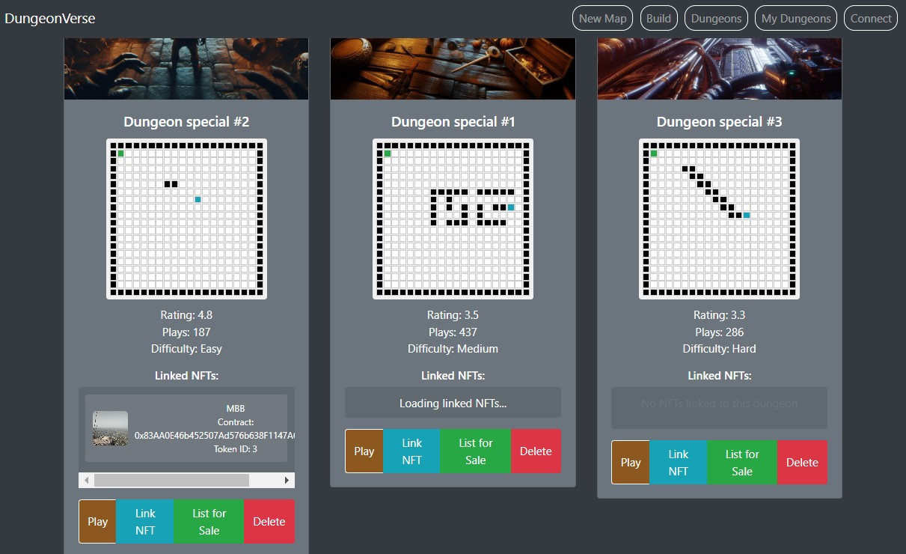

# DungeonVerse

ShapeCraft 2024 Entry

# Introduction

DungeonVerse is a Dungeon crawler builder and game world built on the Shape network - https://shape.network/

Demo Links:

- https://dungeon-verse.vercel.app/index.html
- https://shape.tinyquests.com

# Game World

Players can explore and play dungeons built by dungeon builders.
Playing a dungeon is primarily a web2 experience to encourage wider adoption.
Some dungeons can introduce hybrid experience such as showcasing onchain assets from other projects or triggering a web3 action (finding a loot or completing the game).

## Dungeons Directory

The dungeons directory allows players to easily search and find different dungeons.
It also allows builders to easily share their dungeons.

## Game Play

Playing a dungeon is very simple

### Controls

Platform: The game is playable on any browsers including mobile browsers.

- Keyboard: W,A,S,D or arrow keys allows players to move forward, backwards, turn left or right
- Touch/Mobile swipe: Players on touch devices can swipe the screen to perform the same actions as above

## Building Dungeons

Building a dungeon can be done using the browser based map editor

Walls can be specified with different textures.

Controls:

- Use mouse to click to draw the grid
- You can also use the arrow keys and space bar to place the tiles.

E.g.

### Objects

Builders can add objects such as props or characters

#### Collaboration and incorporating other projects

NFTs from other projects can be placed within dungeons to serve as rewards or decorations.

 

# Dungeons Gallery

Dungeons can be listed to share with other players.
Players can also choose to purchase dungeons that have been listed for sale here.

 

# Dungeons Management (My Dungeons)

Owners of dungeons can manage dungeons linked to their wallet here.
They can choose to sell a dungeon, add NFTs to it etc.
Each dungeon has a snapshot of the map attached to make it easier to find them too.

 

# Smart Contracts

All related smart contracts were built in a separate repo
Please refer to this repo for reference:
https://github.com/ssachin520280/dungeonMOW

# Roadmap

### V0.1 Hackathon Version - MVP

- Deployed on mainnet
- Basic dungeon building and minting
- Dungeon directory

### Next version

- Multi-level dungeons
- Linked dungeons
- More actions/interactions types (advanced combat, puzzles)
- Leaderboards
- Improved UI/UX

### Future

- Story telling
- Multi-player (PvP - Fastest person to clear dungeon wins)
- In-game inventory
- On-chain persistance saving (for large dungeons)
- Parties system
- Mintable themes (game UI skins)

# Attribution

### Audio

- https://freesound.org/

### 3D Models

- https://www.turbosquid.com/3d-models/hob-goblin-1480519
- https://sketchfab.com/3d-models/low-poly-cartoon-chest-24d67f79797143259b58719b498973b7

### Textures

- AI Generated
